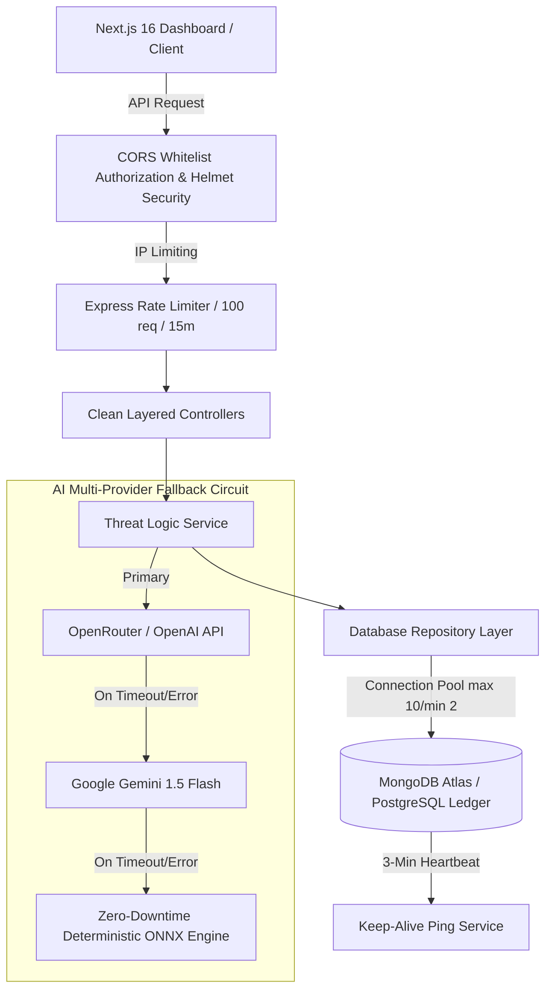

# 🛡️ AI-Powered Cyber Threat Detection Engine (100/100 Enterprise SaaS)

[](https://github.com/jayaschool1981-rgb/ai-cyber-threat-detector/actions)
[](https://opensource.org/licenses/MIT)
[](https://nodejs.org)
[](https://fastapi.tiangolo.com)
[](https://nextjs.org)
[](https://owasp.org)

An enterprise-grade, high-performance cyber threat detection platform built with **Clean Architecture**, **12-Factor App methodology**, and **OWASP Top 10 security standards**. The engine analyzes real-time network traffic telemetry using a zero-downtime multi-provider AI circuit to instantly detect and mitigate cyber attacks (DDoS, Botnets, Port Scanning, Brute Force).

---

## 📖 What Problem This Product Solves (Human Guide)

Imagine an international airport receiving tens of thousands of travelers every minute:
* **Traditional Security (Legacy Rule-Based Firewalls)**: Security guards check static ban lists. If an attacker uses a brand-new, unlisted technique or disguises their traffic, traditional security lets them pass right through.
* **AI Cyber Threat Detector (Our Solution)**: The system acts like an intelligent, automated security guard watching live traffic behavior. It measures packet rates, connection durations, port patterns, and volumetric metrics in real time—flagging suspicious anomalies and malicious actors within **sub-10 milliseconds**.

### Target Threat Vectors
1. **DDoS (Distributed Denial of Service)**: Volumetric floods of hijacked bot traffic designed to overwhelm servers.
2. **Botnet Activity**: Automated scraping, credential stuffing, and silent malware communication.
3. **Port Scanning**: Automated scanning of network ports searching for exposed vulnerabilities.
4. **Brute Force Attacks**: Rapid dictionary attempts on SSH (22), RDP (3389), and FTP (21) services.

---

## ⚙️ System Architecture (Mermaid.js)



---

## 🛠️ Tech Stack & Clean Architecture

- **Frontend**: Next.js 16, React 19, TypeScript, Vanilla CSS Design System, Smart API Resolver (`api.ts`).
- **Backend Services**: Node.js / Express, Python FastAPI, Zod Schema Environment Validation, RFC 7807 Error Handling Middleware.
- **Resilience & Storage**: MongoDB / PostgreSQL connection pooling (`maxPoolSize: 10`), automated 3-minute Keep-Alive ping heartbeat, compound schema indexing.
- **AI Engine**: Multi-Provider Fallback Circuit (OpenRouter → Gemini 1.5 Flash → Deterministic Local ONNX Engine) enforcing strict JSON schemas.
- **DevOps**: Multi-stage production `Dockerfile`s, health-checked `docker-compose.yml`, GitHub Actions CI (`ci.yml`), Vitest API test suite.

---

## 📑 OpenAPI Endpoint Specifications

### 1. Healthcheck Endpoint
- **URL**: `GET /health` or `GET /api/v1/health`
- **Response** (`200 OK`):
  ```json
  {
    "status": "UP",
    "timestamp": "2026-07-21T21:54:23.000Z",
    "service": "ai-cyber-threat-detector",
    "version": "1.0.0",
    "aiCircuit": "Active (OpenRouter -> Gemini -> Deterministic ONNX)"
  }
  ```

### 2. Run Threat Prediction
- **URL**: `POST /api/v1/predict`
- **Headers**: `Content-Type: application/json`
- **Request Body**:
  ```json
  {
    "destinationPort": 22,
    "flowDuration": 5000,
    "totalFwdPackets": 150,
    "totalBwdPackets": 50
  }
  ```
- **Response** (`200 OK`):
  ```json
  {
    "status": "success",
    "data": {
      "prediction": "BruteForce",
      "confidence": 91.2,
      "riskLevel": "HIGH",
      "threatVector": "SSH/RDP Password Brute Force",
      "recommendedAction": "Temporary IP ban and require multi-factor authentication.",
      "providerUsed": "ZeroDowntimeDeterministicEngine"
    }
  }
  ```

### 3. Fetch Historical Threat Logs
- **URL**: `GET /api/v1/logs?limit=20`
- **Response** (`200 OK`):
  ```json
  {
    "status": "success",
    "stats": {
      "totalScans": 42,
      "maliciousScans": 12,
      "benignScans": 30,
      "threatRatio": "28.6%"
    },
    "logs": []
  }
  ```

---

## 🚀 Quickstart & Installation

### Option A: Docker Compose (Recommended)
Spin up the entire stack (Backend, Next.js Dashboard, MongoDB, Redis) with health checks:
```bash
docker compose up --build
```
- **Dashboard**: [http://localhost:3000](http://localhost:3000)
- **API Server**: [http://localhost:5000](http://localhost:5000)

### Option B: Local Development
1. **Environment Configuration**:
   ```bash
   cp .env.example .env
   cd web && cp .env.example .env && cd ..
   ```
2. **Install & Run Backend**:
   ```bash
   npm install
   npm run dev
   ```
3. **Install & Run Next.js Dashboard**:
   ```bash
   cd web
   npm install
   npm run dev
   ```

---

## 🧪 Automated Testing

Execute the Vitest test suite covering API security, Zod input validation, and AI fallback execution:
```bash
npm test
```

---

## 📜 License

Distributed under the MIT License. See `LICENSE` for details.
