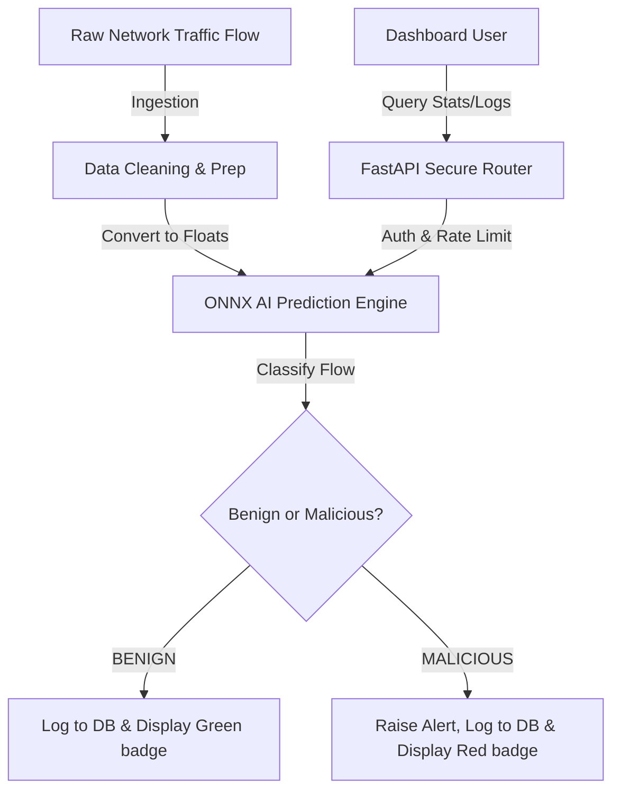

# 🛡️ AI-Powered Cyber Threat Detection Engine

Welcome to the **AI-Powered Cyber Threat Detector**! This project is a state-of-the-art security platform that uses Artificial Intelligence (AI) and Machine Learning (ML) to monitor network connections, analyze their behavior, and instantly flag malicious activity before it can harm infrastructure.

---

## 📖 The Big Picture: An Analogy

Imagine a massive international airport. Thousands of passengers walk through the gates every minute. 
* **Traditional Security (Old Way)**: The guards have a list of known banned items (like scissors or liquids over 100ml). If a passenger carries something on that list, they are stopped. But what if a passenger brings a brand-new, highly dangerous item that isn't on the list? Traditional security misses it completely.
* **AI Security (This Project)**: Instead of just looking at a static checklist, the security system acts like a super-smart guard who observes *behavior*. It notices if someone is sweating, pacing, walking back and forth repeatedly, or wearing a heavy winter coat in July. The system has analyzed millions of normal passengers and automatically flags anyone behaving unusually.

This system is that smart security guard, but for computer network traffic. It observes how data moves and automatically flags hackers, bots, and digital attacks.

---

## 🚫 The Problem We Are Solving

When you visit a website or use a mobile app, data is sent back and forth between your device and a server. This is called **Network Traffic**. 

However, bad actors (hackers) exploit this connection to launch attacks. Traditional firewalls try to block them using simple, rigid rules. Unfortunately, modern cyber attacks are dynamic and change constantly to bypass these rules.

We target the following dangerous threat vectors:
1. **DDoS (Distributed Denial of Service)**: Attackers command thousands of infected computers (bots) to spam a website all at once, crashing it. It is the digital equivalent of 10,000 people trying to squeeze through a store's front doors at the exact same second, blocking legitimate shoppers.
2. **Botnets**: Hijacked devices silently controlled by a hacker to scrape data, spam users, or brute-force login credentials.
3. **Port Scanning**: Hackers sniffing around a system looking for weak, unlocked "doors" (network ports) to break in.

### The AI Solution:
Instead of writing millions of rigid rules, we feed historical network traffic data (the famous **CICIDS2017** security dataset) into a Machine Learning brain (a **Random Forest Classifier**). The AI learns what "normal, healthy traffic" looks like (e.g. reading news, browsing a catalog) and how it differs from a malicious attack (e.g. opening hundreds of connections a second).

---

## ⚙️ How It Works (Under the Hood)

This system is broken down into modular phases:



### 1. The Preprocessing Pipeline (Data Cleaning)
Before the AI can read network data, the raw connection statistics (like ports, duration, packet length, etc.) must be normalized. We scale numeric inputs and handle categorical inputs so the mathematical models can process them correctly.

### 2. High-Performance ONNX Compilation
Standard AI models run slowly in web servers. We compiled our model into the **ONNX (Open Neural Network Exchange)** format. Think of this like translating a massive textbook into a quick pocket reference card. ONNX allows the server to make threat predictions in under **10 milliseconds**!

### 3. Database Ledger (PostgreSQL)
Every single network flow that is scanned gets recorded in our database ledger. It stores the classification (`BENIGN` or `MALICIOUS`), the AI's confidence percentage, port details, and the time the flow was checked.

### 4. Security Gate (JWT & Rate Limiting)
To prevent unauthorized users from tampering with our security scans:
* **JWT (JSON Web Tokens)**: A secure digital passport system. Users must register and log in to get a token before they can make queries or access prediction tools.
* **Rate Limiting (Redis)**: Limits how many requests a user or client can send in a minute. This prevents attackers from spamming our detection API and slowing down the system.

### 5. Automated Quality Checks
Every time a code change is made, an automated test runner (Pytest) runs a battery of test simulations verifying registration, token encryption, model accuracy, and rate limits. If a single check fails, GitHub Actions halts the deployment.

### 6. The User Dashboard
A dark-theme dashboard designed for security administrators. It displays:
* **Current System Status**: Shows a glowing green **SECURE** or flashing red **AT RISK** indicator.
* **Threat Ratio**: The percentage of malicious scans compared to safe scans.
* **Interactive Simulator**: Allows users to enter custom values (Port, Duration, Packets) and immediately see the AI's classification.
* **Live Threat Logs**: A chronological list of recent scans stored in the database.

---

## 🚀 Setting Up the Project Locally

No advanced programming skills needed! Here is how to run the project.

### Method A: The Non-Tech Way (Docker Compose)
If you have **Docker** installed, you can spin up the entire system (FastAPI, PostgreSQL Database, and Redis Cache) with a single command!

1. Open your terminal in the root directory.
2. Run:
   ```bash
   docker compose up --build
   ```
3. Open your browser:
   * **FastAPI Backend (Interactive docs)**: [http://localhost:8000/docs](http://localhost:8000/docs)
   * **Next.js Dashboard**: [http://localhost:3000](http://localhost:3000) (if running frontend container or dev server).

---

### Method B: The Developer Way (Local Run)

#### Step 1: Initialize Virtual Environment & Install Libraries
Create a Python virtual environment to store dependencies:
```bash
# Windows
python -m venv .venv
.venv\Scripts\activate

# Mac/Linux
python3 -m venv .venv
source .venv/bin/activate

# Install dependencies
pip install -r requirements.txt
```

#### Step 2: Compile the AI Model
Convert the trained Python model into the high-performance ONNX format:
```bash
python -m src.pipelines.export_onnx
```
This generates the optimized `models/model.onnx` file.

#### Step 3: Run the Backend Server
```bash
python -m api.main
```
*The server will boot on port `8000`. If you do not have PostgreSQL running, it will automatically fall back to a local SQLite file (`threats.db`) so the system keeps running.*

#### Step 4: Run the Next.js Frontend Dashboard
Open a new terminal, navigate to the `web/` directory, and run:
```bash
npm install
npm run dev
```
Open [http://localhost:3000](http://localhost:3000) in your browser.

---

## 🔒 Security Sandbox Warning
This is a secure simulation sandbox. All credentials entered are hashed and stored locally. No network traffic leaves your machine.
